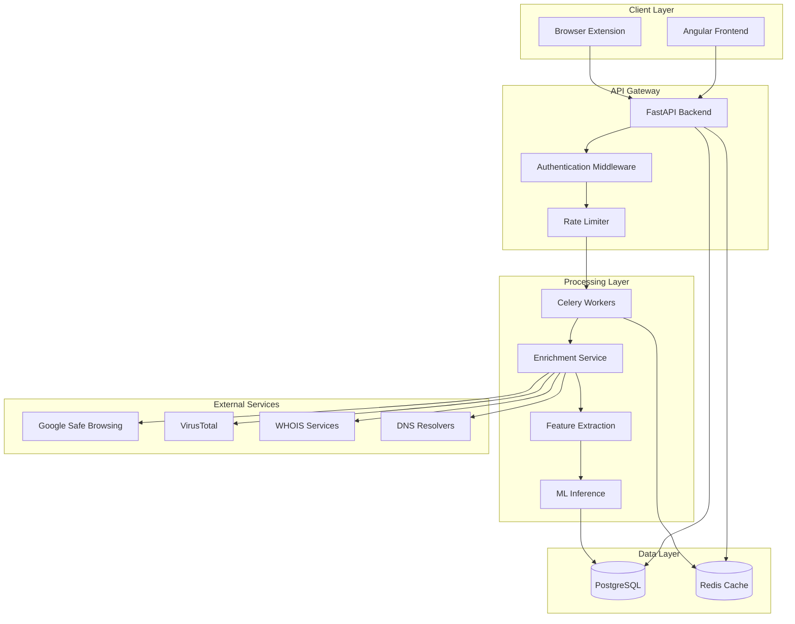
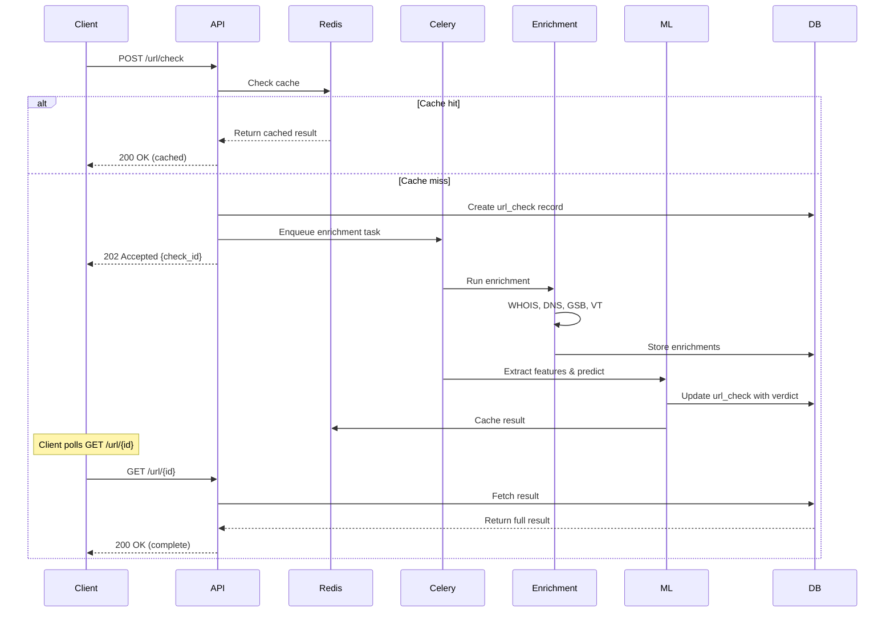
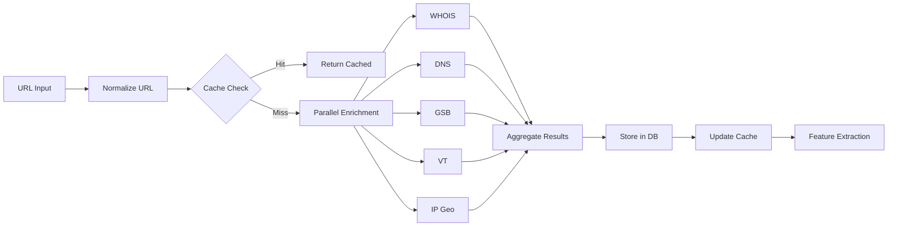

# Architecture Overview

## System Architecture

The URL Phishing Detection System follows a microservices-inspired architecture with clear separation of concerns:



## Component Details

### 1. Client Layer

#### Browser Extension
- **Technology**: Manifest V3 (Chrome/Firefox compatible)
- **Responsibilities**:
  - Context menu integration for right-click URL checks
  - Popup UI for manual URL submission
  - Background service worker for API communication
  - Local caching of recent checks
- **Permissions**: `activeTab`, `contextMenus`, `storage`

#### Angular Frontend
- **Technology**: Angular 16+ with Material UI
- **Responsibilities**:
  - URL submission interface
  - Dashboard with recent checks
  - Detailed result view with enrichment data
  - Search and filter functionality
  - Statistics and analytics
- **State Management**: RxJS observables
- **Routing**: Lazy-loaded modules for performance

### 2. API Gateway (FastAPI)

#### Core Responsibilities
- Request validation (Pydantic schemas)
- Authentication (API key based)
- Rate limiting (10 req/min per IP)
- Request routing
- Response formatting
- Error handling

#### Middleware Stack
1. **CORS Middleware**: Allow frontend and extension origins
2. **Authentication Middleware**: Validate API keys
3. **Rate Limiting Middleware**: Redis-backed token bucket
4. **Logging Middleware**: Structured logging with request IDs
5. **Error Handler**: Standardized error responses

#### API Versioning
- Base path: `/api/v1/`
- Future versions: `/api/v2/` with backward compatibility

### 3. Processing Layer

#### Celery Workers
- **Broker**: Redis
- **Backend**: Redis (for result storage)
- **Concurrency**: 4 workers (configurable)
- **Tasks**:
  - `enrich_url_task`: Orchestrates enrichment pipeline
  - `extract_features_task`: Runs feature extraction
  - `predict_task`: ML inference
  - `cache_cleanup_task`: Periodic cache invalidation

#### Enrichment Service
Modular enrichment with fallback handling:

```python
class EnrichmentService:
    async def enrich(self, url: str) -> EnrichmentResult:
        tasks = [
            self.whois_lookup(url),
            self.dns_lookup(url),
            self.gsb_check(url),
            self.virustotal_check(url),
            self.ip_geolocation(url)
        ]
        results = await asyncio.gather(*tasks, return_exceptions=True)
        return self.aggregate_results(results)
```

**Caching Strategy**:
- WHOIS: 7 days TTL
- DNS: 1 hour TTL
- Google Safe Browsing: 30 minutes TTL
- VirusTotal: 24 hours TTL
- IP Geo: 30 days TTL

#### Feature Extraction Service
Extracts 25 features in 4 categories:

1. **Lexical Features** (fast, no external calls)
   - URL parsing and tokenization
   - Statistical analysis (entropy, ratios)
   - Pattern matching (suspicious keywords)

2. **Host-Based Features** (requires enrichment data)
   - Domain age calculation
   - SSL certificate validation
   - Subdomain analysis

3. **Content-Based Features** (optional, slow)
   - HTML parsing (if page accessible)
   - Form detection
   - Brand keyword matching

4. **Threat-Intel Features** (from enrichment)
   - Aggregation of GSB, VT, blocklists

#### ML Inference Service
- **Model Format**: Pickled scikit-learn models
- **Versioning**: Models stored with version tags (e.g., `model_v1.2.0.pkl`)
- **Loading**: Lazy loading on first request
- **Explainability**: SHAP values or feature importances
- **Fallback**: If model fails, return "unknown" verdict

### 4. Data Layer

#### PostgreSQL Schema

**url_checks** (main table)
- Primary key: UUID
- Indexes: `normalized_url`, `timestamp`, `verdict`
- Partitioning: Monthly partitions for scalability

**enrichments** (1-to-many with url_checks)
- Foreign key: `url_check_id`
- JSONB columns for flexible schema
- Indexes: `url_check_id`, `source`

**threat_intel_cache** (lookup table)
- Unique constraint: `lookup_key`
- TTL-based expiration (checked on read)
- Indexes: `lookup_key`, `last_checked_at`

**audit_logs** (append-only)
- No foreign keys (for performance)
- Retention: 90 days
- Indexes: `created_at`, `action`

#### Redis Cache
- **Structure**: Hash maps for enrichment data
- **Key format**: `cache:{type}:{value}` (e.g., `cache:domain:example.com`)
- **Eviction**: LRU policy with 1GB max memory
- **Persistence**: RDB snapshots every 5 minutes

### 5. External Services Integration

#### Google Safe Browsing API
```python
# Lookup API v4
POST https://safebrowsing.googleapis.com/v4/threatMatches:find
{
  "client": {"clientId": "phishing-detector", "clientVersion": "1.0"},
  "threatInfo": {
    "threatTypes": ["MALWARE", "SOCIAL_ENGINEERING"],
    "platformTypes": ["ANY_PLATFORM"],
    "threatEntryTypes": ["URL"],
    "threatEntries": [{"url": "http://example.com/"}]
  }
}
```

**Rate Limit**: 10,000 requests/day (free tier)
**Retry Strategy**: Exponential backoff (3 retries)

#### VirusTotal API
```python
# URL Reports API v3
GET https://www.virustotal.com/api/v3/urls/{url_id}
Headers: x-apikey: YOUR_API_KEY
```

**Rate Limit**: 4 requests/min, 500/day (free tier)
**Queue Management**: Celery task with rate limiting
**Retry Strategy**: 429 errors → wait 60s, then retry

#### WHOIS Lookup
- **Library**: `python-whois`
- **Fallback**: Multiple WHOIS servers
- **Parsing**: Regex-based extraction of registration date, registrar

#### DNS Resolution
- **Library**: `dnspython`
- **Queries**: A, AAAA, MX, TXT records
- **Timeout**: 5 seconds per query

## Data Flow

### URL Check Request Flow



### Enrichment Pipeline



## Scalability Considerations

### Horizontal Scaling
- **API**: Stateless, can run multiple instances behind load balancer
- **Celery Workers**: Add more workers to handle increased load
- **Redis**: Redis Cluster for distributed caching
- **PostgreSQL**: Read replicas for search queries

### Vertical Scaling
- **Database**: Increase connection pool size
- **Redis**: Increase max memory
- **Workers**: Increase concurrency per worker

### Performance Optimizations
1. **Database Indexing**: Composite indexes on common query patterns
2. **Connection Pooling**: Reuse DB connections (SQLAlchemy pool)
3. **Async I/O**: FastAPI + asyncio for non-blocking operations
4. **Batch Processing**: Batch VirusTotal requests when possible
5. **CDN**: Serve frontend static assets via CDN

## Security Architecture

### Defense in Depth

1. **Network Layer**
   - HTTPS only (TLS 1.3)
   - Firewall rules (allow only necessary ports)
   - DDoS protection (Cloudflare/AWS Shield)

2. **Application Layer**
   - Input validation (Pydantic)
   - SQL injection prevention (parameterized queries)
   - XSS protection (Angular sanitization)
   - CSRF tokens for state-changing operations

3. **Data Layer**
   - Encryption at rest (PostgreSQL TDE)
   - Encryption in transit (SSL connections)
   - Least-privilege database users
   - Regular backups with encryption

4. **API Security**
   - API key authentication
   - Rate limiting (per IP and per API key)
   - Request size limits
   - Timeout enforcement

### Secrets Management
- **Development**: `.env` files (gitignored)
- **Production**: AWS Secrets Manager / HashiCorp Vault
- **Rotation**: Automated key rotation every 90 days

## Monitoring & Observability

### Metrics (Prometheus)
- Request rate, latency, error rate
- Celery queue length, task duration
- Cache hit rate
- External API success rate
- Model prediction distribution

### Logging (Structured JSON)
```json
{
  "timestamp": "2025-11-25T21:30:00Z",
  "level": "INFO",
  "request_id": "abc-123",
  "endpoint": "/api/v1/url/check",
  "url": "https://example.com",
  "verdict": "benign",
  "confidence": 0.95,
  "duration_ms": 1234
}
```

### Alerting
- API error rate >5% for 5 minutes
- Celery queue length >100
- External API failures >50% for 10 minutes
- Database connection pool exhaustion

### Tracing (OpenTelemetry)
- Distributed tracing across API → Celery → External APIs
- Span annotations for enrichment steps
- Performance bottleneck identification

## Deployment Architecture

### Docker Compose (Development)
```yaml
services:
  api:
    build: ./backend
    ports: ["8000:8000"]
  
  celery:
    build: ./backend
    command: celery -A app.tasks worker
  
  frontend:
    build: ./frontend
    ports: ["4200:4200"]
  
  postgres:
    image: postgres:14
    volumes: ["pgdata:/var/lib/postgresql/data"]
  
  redis:
    image: redis:6
```

### Kubernetes (Production)
- **API**: Deployment with 3 replicas, HPA (CPU >70%)
- **Celery**: Deployment with 5 replicas, HPA (queue length >50)
- **PostgreSQL**: StatefulSet with persistent volume
- **Redis**: StatefulSet with persistent volume
- **Ingress**: NGINX Ingress Controller with TLS

## Disaster Recovery

### Backup Strategy
- **Database**: Daily full backups, hourly incremental
- **Redis**: RDB snapshots every 5 minutes
- **Models**: Versioned artifacts in S3

### Recovery Procedures
- **Database Restore**: <30 minutes RTO, <1 hour RPO
- **Service Restart**: <5 minutes
- **Full System Rebuild**: <2 hours

## Future Enhancements

1. **GraphQL API**: For more flexible querying
2. **WebSocket**: Real-time updates instead of polling
3. **Neo4j Integration**: Graph-based domain/IP relationship analysis
4. **Federated Learning**: Privacy-preserving model updates
5. **Multi-tenancy**: Support for enterprise customers
6. **A/B Testing**: Gradual model rollouts with traffic splitting
